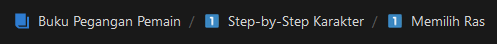

# Buku Pegangan Pemain

Untuk kembali ke halaman atau bagian sebelumnya bisa menekan pilihan  bagian yang ada di kanan atas.

## Daftar Isi

[Pendahuluan](buku-pegangan-pemain/Pendahuluan.md)

<aside>
ℹ️ Isi dari Bab Perkenalan:

[Dunia Petualangan](buku-pegangan-pemain/pendahuluan/DuniaPetualangan.md)

[Penggunaan Peraturan Ini](buku-pegangan-pemain/pendahuluan/PenggunaanPeraturanIni.md) 

[Cara Bermain](Buku%20Pegangan%20Pemain%209ee9b211b08d4449b3c7697518caa49d/Pendahuluan%20f2eb671a676646769910c48c1e2eaf25/Cara%20Bermain%20410dc7c8fb7748ccb6222d9b9fe6f69d.md) 

[Petualangan](Buku%20Pegangan%20Pemain%209ee9b211b08d4449b3c7697518caa49d/Pendahuluan%20f2eb671a676646769910c48c1e2eaf25/Petualangan%208b31e0686285492fbc2534ca6111efb3.md) 

</aside>

[Step-by-Step Karakter](Buku%20Pegangan%20Pemain%209ee9b211b08d4449b3c7697518caa49d/Step-by-Step%20Karakter%20eb423c323674404c870b71cf9bf490b1.md)

<aside>
1️⃣ Isi dari Bab Step-by-Step Karakter

[Memilih Ras](Buku%20Pegangan%20Pemain%209ee9b211b08d4449b3c7697518caa49d/Step-by-Step%20Karakter%20eb423c323674404c870b71cf9bf490b1/Memilih%20Ras%201bfcb91c11b448649bbb85d7d23b9597.md) 

[Memilih Class](Buku%20Pegangan%20Pemain%209ee9b211b08d4449b3c7697518caa49d/Step-by-Step%20Karakter%20eb423c323674404c870b71cf9bf490b1/Memilih%20Class%20906e2640d378496cba0d4cce3884f6ed.md) 

[Menentukan Ability Score](Buku%20Pegangan%20Pemain%209ee9b211b08d4449b3c7697518caa49d/Step-by-Step%20Karakter%20eb423c323674404c870b71cf9bf490b1/Menentukan%20Ability%20Score%200e78631178f044afb5d718dbfdcbb7cf.md) 

[Mendeskripsikan Karaktermu](Buku%20Pegangan%20Pemain%209ee9b211b08d4449b3c7697518caa49d/Step-by-Step%20Karakter%20eb423c323674404c870b71cf9bf490b1/Mendeskripsikan%20Karaktermu%201ef315d5334b4ea4b06dfc663a12f65b.md) 

[Memilih Equipment](Buku%20Pegangan%20Pemain%209ee9b211b08d4449b3c7697518caa49d/Step-by-Step%20Karakter%20eb423c323674404c870b71cf9bf490b1/Memilih%20Equipment%2023ddef4f9fef47ffb4f84cc8e563745e.md) 

[Membentuk Kelompok](Buku%20Pegangan%20Pemain%209ee9b211b08d4449b3c7697518caa49d/Step-by-Step%20Karakter%20eb423c323674404c870b71cf9bf490b1/Membentuk%20Kelompok%2061e0bd568d174342b5467e49af908103.md) 

[Level 1 ke Atas](Buku%20Pegangan%20Pemain%209ee9b211b08d4449b3c7697518caa49d/Step-by-Step%20Karakter%20eb423c323674404c870b71cf9bf490b1/Level%201%20ke%20Atas%200690156815a1480c8281ef410bc93b1d.md) 

</aside>

[Ras](Buku%20Pegangan%20Pemain%209ee9b211b08d4449b3c7697518caa49d/Ras%20d0e873a4ba1142649f8d679dd34fef98.md)

<aside>
2️⃣ Isi dari Bab Ras

[Memilih Ras](Buku%20Pegangan%20Pemain%209ee9b211b08d4449b3c7697518caa49d/Ras%20d0e873a4ba1142649f8d679dd34fef98/Memilih%20Ras%20d8fd565ba73c451f87a7c5c3702f9d66.md) 

[**Trait Rasial**](Buku%20Pegangan%20Pemain%209ee9b211b08d4449b3c7697518caa49d/Ras%20d0e873a4ba1142649f8d679dd34fef98/Trait%20Rasial%20a91ee5ba748e4659a82f2659e5bc3496.md) 

[Dwarf](Buku%20Pegangan%20Pemain%209ee9b211b08d4449b3c7697518caa49d/Ras%20d0e873a4ba1142649f8d679dd34fef98/Dwarf%20a54b1cf032524d2cbffd896d25647dd4.md) 

[Elf](Buku%20Pegangan%20Pemain%209ee9b211b08d4449b3c7697518caa49d/Ras%20d0e873a4ba1142649f8d679dd34fef98/Elf%20953573d18e2c42618289477ccc2844d9.md) 

[Halfling](Buku%20Pegangan%20Pemain%209ee9b211b08d4449b3c7697518caa49d/Ras%20d0e873a4ba1142649f8d679dd34fef98/Halfling%2070a88ddd634a4074897a1627b536ebd7.md) 

[Human](Buku%20Pegangan%20Pemain%209ee9b211b08d4449b3c7697518caa49d/Ras%20d0e873a4ba1142649f8d679dd34fef98/Human%20fce845d5facb45a3bc72ad5c157452ee.md) 

[Dragonborn](Buku%20Pegangan%20Pemain%209ee9b211b08d4449b3c7697518caa49d/Ras%20d0e873a4ba1142649f8d679dd34fef98/Dragonborn%20306222b08dc245cdaea79bb9627ebed5.md) 

[Gnome](Buku%20Pegangan%20Pemain%209ee9b211b08d4449b3c7697518caa49d/Ras%20d0e873a4ba1142649f8d679dd34fef98/Gnome%20f88e8d577ec8469fb33cf4c7ffa0faf6.md)

[Half-Elf](Buku%20Pegangan%20Pemain%209ee9b211b08d4449b3c7697518caa49d/Ras%20d0e873a4ba1142649f8d679dd34fef98/Half-Elf%20dbf15b4479d1459cac884b97b17bc3b3.md) 

[Half-Orc](Buku%20Pegangan%20Pemain%209ee9b211b08d4449b3c7697518caa49d/Ras%20d0e873a4ba1142649f8d679dd34fef98/Half-Orc%2022ee1d37f4034463940c3ca8d88e84d8.md) 

[Tiefling](Buku%20Pegangan%20Pemain%209ee9b211b08d4449b3c7697518caa49d/Ras%20d0e873a4ba1142649f8d679dd34fef98/Tiefling%20fe21c2c3029846f99c79ef5b1a3e4979.md) 

</aside>

[Class](Buku%20Pegangan%20Pemain%209ee9b211b08d4449b3c7697518caa49d/Class%20b8615a765d8449f19066222f3fbb17e4.md)

[Kepribadian dan Latar Belakang](Buku%20Pegangan%20Pemain%209ee9b211b08d4449b3c7697518caa49d/Kepribadian%20dan%20Latar%20Belakang%20e1462440626e48c58161abbfd01813e4.md)

[Equipment](Buku%20Pegangan%20Pemain%209ee9b211b08d4449b3c7697518caa49d/Equipment%206c7549bfa21a4d6aab7a86d68fcd03a0.md)

[Pilihan Kostumisasi](Buku%20Pegangan%20Pemain%209ee9b211b08d4449b3c7697518caa49d/Pilihan%20Kostumisasi%20faf705d1ad224291ac0a3ac4f67595da.md)

[Menggunakan Ability Score](Buku%20Pegangan%20Pemain%209ee9b211b08d4449b3c7697518caa49d/Menggunakan%20Ability%20Score%20756533a7e92348eda62dc40cce630365.md)

[Petualangan](Buku%20Pegangan%20Pemain%209ee9b211b08d4449b3c7697518caa49d/Petualangan%206be540a7701a490a9eecc23c13a7a80a.md)

[Combat](Buku%20Pegangan%20Pemain%209ee9b211b08d4449b3c7697518caa49d/Combat%2021901f5895d342f3bfc600f80bb9c395.md)

[Spellcasting](Buku%20Pegangan%20Pemain%209ee9b211b08d4449b3c7697518caa49d/Spellcasting%20aac3f89cf26e483ba27062bd12bde213.md)

[Spell](Buku%20Pegangan%20Pemain%209ee9b211b08d4449b3c7697518caa49d/Spell%20be1a3195ab42445ab55f231331b78de4.md)

[Lampiran A: Kondisi](Buku%20Pegangan%20Pemain%209ee9b211b08d4449b3c7697518caa49d/Lampiran%20A%20Kondisi%200a98dc30663e478492f30bc31aa591fd.md)

[Lampiran B: Dewa dari Multiverse](Buku%20Pegangan%20Pemain%209ee9b211b08d4449b3c7697518caa49d/Lampiran%20B%20Dewa%20dari%20Multiverse%201f1b0c7c7eae416aacf88911d1a76aca.md)

[Lampiran C: Lima Faksi](Buku%20Pegangan%20Pemain%209ee9b211b08d4449b3c7697518caa49d/Lampiran%20C%20Lima%20Faksi%20d4d897d35ac24936a7616642978dde39.md)

[Lampiran D: Alam Kehidupan](Buku%20Pegangan%20Pemain%209ee9b211b08d4449b3c7697518caa49d/Lampiran%20D%20Alam%20Kehidupan%20be0e7b5eacb1439283d0713b439ac61b.md)

## **Translator**

---

Di translasi oleh Laniaz, jika ada **kritik** ataupun **saran** tolong beritahu saya di
Discord: @nidibalaniaz
Kalau mau **donasi** silahkan di: [https://saweria.co/nidibalaniaz](https://saweria.co/nidibalaniaz)

## Resources

---

SRD (Basic Rules) dari website DnD Beyond:

[https://www.dndbeyond.com/sources/basic-rules](https://www.dndbeyond.com/sources/basic-rules)
